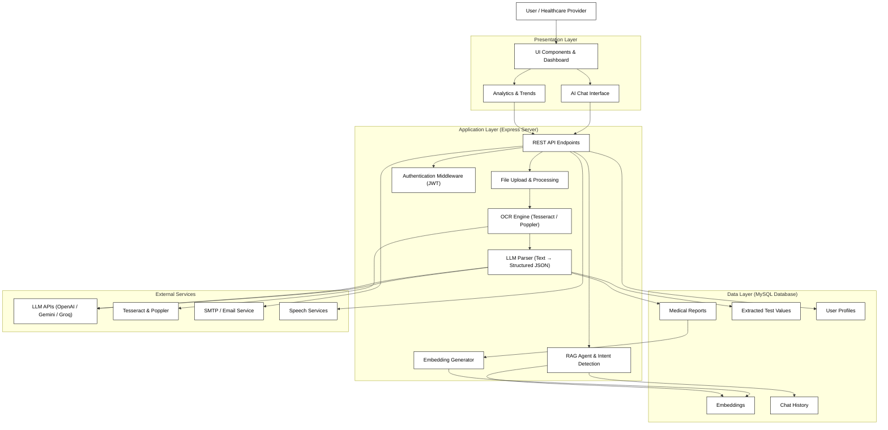

KLH — Medical Reports AI Assistant
=================================

KLH is an AI-powered medical report ingestion and assistant platform. The server ingests PDFs and images, extracts text via OCR, uses an LLM to parse structured medical data, stores embeddings and test values, and provides a conversational AI assistant (RAG) for both general and medical-specific questions.

Highlights
----------
- OCR extraction from images and PDFs (Tesseract + pdf-poppler)
- LLM parsing (Google Gemini / Groq / OpenAI integrations) to extract structured medical fields and multilingual explanations
- Embeddings for RAG-style retrieval over past reports
- Conversational AI assistant with intent detection (medical vs non-medical)
- Persistence of reports, extracted tests, and embeddings (MySQL)
- Streamlit utilities for quick analysis and prototyping

Repository Layout
-----------------
- `client/` — React + Vite frontend (dashboard, chat UI, uploads)
- `server/` — Express API, ingestion, agent, controllers, and models
- `streamlit/` — analysis notebooks and dashboards

Core Flow
---------
1. User uploads medical reports via `/api/upload` (authenticated).
2. Server extracts text with OCR and converts PDFs to images when needed.
3. Extracted text is sent to the LLM to produce strict JSON (structured tests, patient metadata, multilingual explanations).
4. LLM output is embedded and stored; test values are saved to the DB.
5. The `/api/ask` endpoint uses embeddings + recent conversation memory to answer user questions — medical questions trigger RAG over saved reports.

User Flow (UI walkthrough)
--------------------------
The application UI follows a simple, user-friendly flow. Below are the typical screens and actions (images are stored in `client/public`):

- Home / Branding:


- Upload reports: drag-and-drop or select files (images/PDF).


- Dashboard / Trends: real-time trends and per-user analytics.


- AI Assistant: ask questions and receive context-aware answers (RAG).


- Additional analytics view:


Architecture Diagram
--------------------

```
CSV/PDF Upload
      |
      v
Express Backend --------- MySQL Database
      |                        |
      ├─ Ingest Router         ├─ Medical Reports
      ├─ File Controller       ├─ Parsed Test Values
      ├─ OCR (Tesseract)       ├─ Embeddings
      ├─ LLM Parser            ├─ Chat History
      ├─ Agent Controller      ├─ User Profiles
      ├─ Embeddings Generator  └─ Trends Data
      ├─ Auth Middleware
      └─ Notifications
      |
      v
React + Vite Frontend (Dashboard, Chat, Upload, Trends)
      |
      ├─ Home / Landing Page
      ├─ Upload UI (Drag & Drop)
      ├─ Dashboard (Charts, Analytics)
      ├─ AI Assistant (RAG Chat)
      ├─ Trends / Reports
      └─ User Profile
      |
      v
Streamlit Analytics (Optional)
      |
      ├─ Data Exploration
      ├─ Report Summaries
      ├─ Trend Analysis
      └─ User Insights

External Integrations:
      |
      ├─ LLM APIs (Google Gemini, Groq, OpenAI)
      ├─ Tesseract OCR + Poppler
      ├─ Email / SMTP (nodemailer)
      └─ Speech Services (Azure Cognitive)
```

Mermaid Diagram (detailed flowchart):



If you'd like, I can also generate a rendered SVG/PNG using the Mermaid CLI and add it to `client/public`.

Security & Privacy
-------------------
- Medical data is sensitive. Use secure storage, encrypted DB connections, and proper access controls in production.
- Do not commit API keys or secrets into source control. Use environment variables or secret stores.

Tech Stack
----------

| Layer | Technology | Purpose |
|-------|-----------|---------|
| **Frontend** | React 18.x, Vite 5.x, Axios | UI, fast bundling, API calls |
| **Server** | Node.js 18+, Express.js 4.18+ | REST API and routing |
| **Authentication** | JWT, jsonwebtoken | Secure token-based auth |
| **File Handling** | Multer, Tesseract.js, pdf-poppler | File upload, OCR, PDF conversion |
| **LLM / AI** | Google Gemini, Groq, OpenAI | Text parsing and embeddings |
| **Embeddings** | @xenova/transformers | Local transformer embeddings |
| **Database** | MySQL 5.7+, mysql2 | Relational storage for reports & data |
| **Email** | nodemailer | Email notifications |
| **Security** | bcryptjs | Password hashing |
| **Analytics** | Streamlit, pandas, matplotlib | Dashboards and data visualization |
| **Dev Tools** | nodemon, dotenv | Auto-reload and env management |


Key Server Routes
-----------------
- `POST /api/register` — user signup
- `POST /api/login` — user signin
- `POST /api/send-mail` — trigger emails
- `POST /api/upload` — authenticated file upload (images/PDFs)
- `POST /api/ask` — ask the AI assistant (authenticated)
- `GET /api/trends` — user-specific trends and analytics (authenticated)

Prerequisites
-------------
- Node.js 18+
- Python 3.11+ (for Streamlit utilities)
- Tesseract OCR installed on the host
- Poppler utilities installed (for `pdf-poppler`)
- A running MySQL server (or adapt `reportModel` to your DB)
- Optional: Google Gemini / Groq / OpenAI API keys for LLM features

Environment Variables (server/.env)
----------------------------------
- `PORT` — server port (default 5000)
- `JWT_SECRET` — JWT signing secret
- `MYSQL_HOST` — MySQL host
- `MYSQL_USER` — MySQL user
- `MYSQL_PASSWORD` — MySQL password
- `MYSQL_DATABASE` — MySQL database name
- `GEMINI_API_KEY` — Google Gemini key (optional)
- `GROQ_API_KEY` — Groq.ai key (optional)
- `OPENAI_API_KEY` — OpenAI key (optional)
- `GROQ_API_KEY` — Groq API key (used by `agentController` / tag generation)

Quick Start (development)
-------------------------
1) Server

```bash
cd server
npm install
# run the server (or use nodemon)
node server.js
```

2) Client

```bash
cd client
npm install
npm run dev
```

3) Streamlit (optional)

```bash
cd streamlit
python -m pip install -r requirements.txt
streamlit run app.py
```

Running a sample upload
-----------------------
- Use the web UI to upload images/PDFs, or POST to `/api/upload` with a valid JWT and `multipart/form-data` containing `file`.

Notes & Troubleshooting
-----------------------
- Ensure Tesseract and Poppler are installed and on your PATH; OCR and PDF conversion will fail otherwise.
- LLM integrations are optional: if no API keys are provided, the app uses cached fallbacks or returns informative messages rather than crashing.
- `server/models/reportModel.js` contains DB access patterns; update connection settings and schema to match your MySQL setup.

Security and Privacy
--------------------
- Medical data is sensitive. Use secure storage, encrypted DB connections, and proper access controls in production.
- Do not commit API keys or secrets into source control. Use environment variables or secret stores.

Contributing
------------
Please open issues for bugs or feature requests. Pull requests are welcome — keep changes focused and include tests where appropriate.

